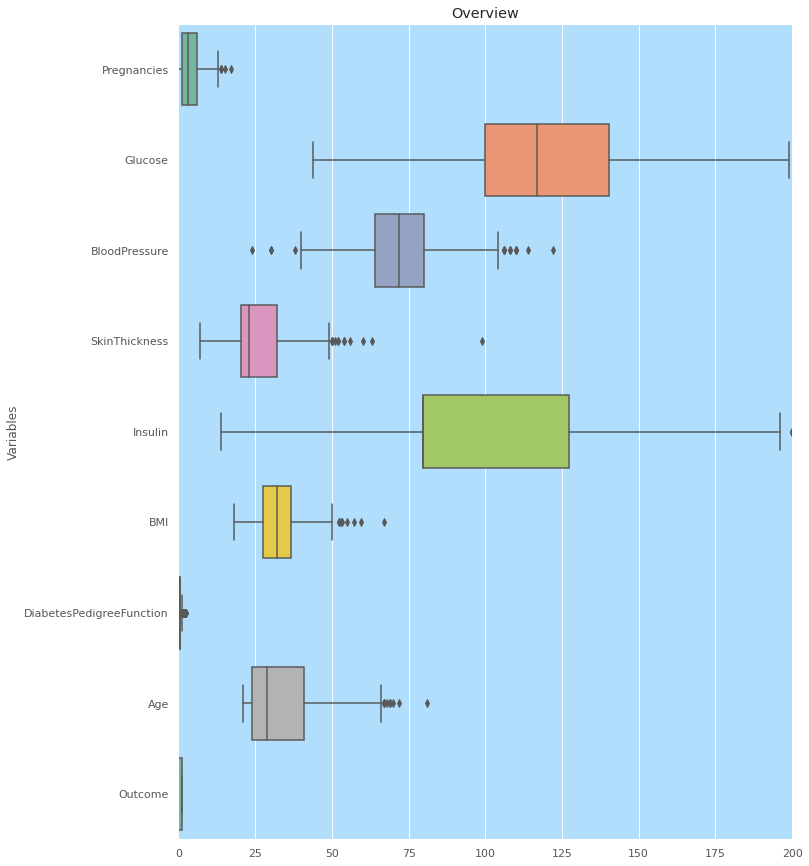
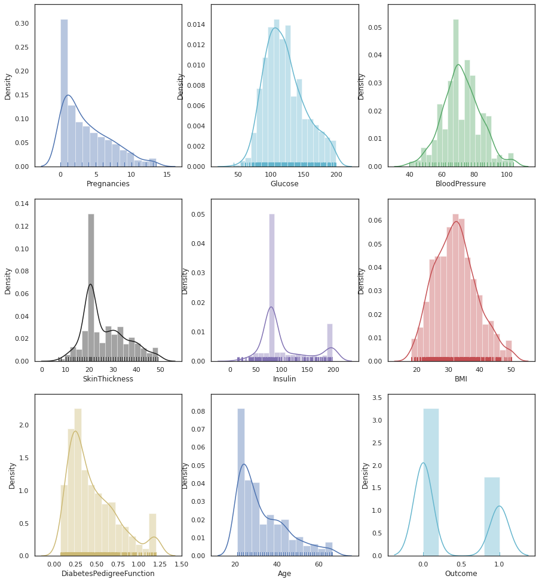
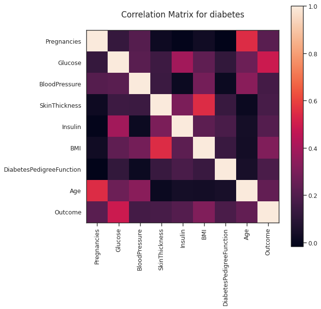
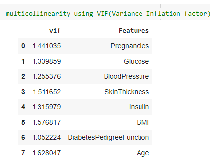
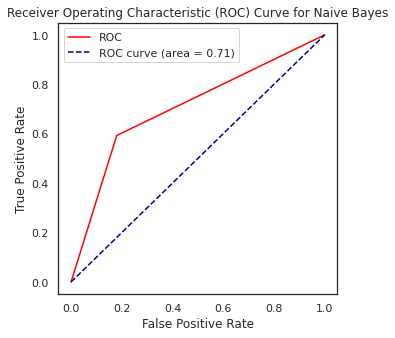
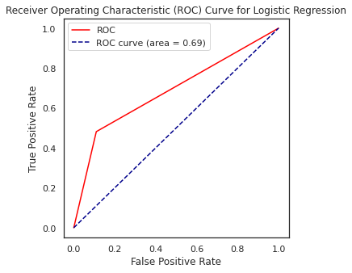

# Predict the Diabetes based on diagnostic measures
Building a classification model and predict the Diabetes based on given diagnostic measures. 

# Box Plot Visualization of Dataset

#Distribution of Dataset

#Correlations of Features

#AUC

